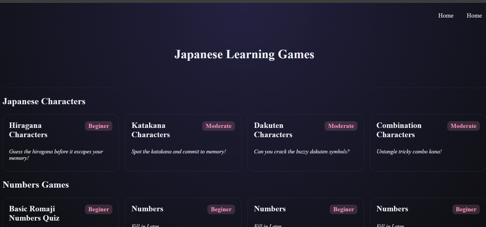

# 🇯🇵 Nihon-Learning-Games

This project will be a collection of Japanese learning games and quizzes designed to help users master characters, basic numbers and beginner-level vocabulary. It will include matching games, quizzes, and memory-style challenges to create an engaging and interactive learning experience.

This is a **self-practice exercise** Built using React, along with HTML5, CSS, and JavaScript, the project strengthens front-end development skills — including component-based architecture, state management, DOM manipulation, and dynamic UI updates — while reinforcing essential Japanese language fundamentals.

---

## ✨ Features

- Input-based answer system or multiple choice
- Score tracking
- Instant feedback (correct / incorrect)
- Clean and simple UI

---

## 🛠️ Technologies Used

- **HTML5**
- **CSS**
- **JavaScript**
- **React**

---

## ▶️ How to Play

1. Load the page in your browser
2. Choose an available game, follow instructions and play game to best of your ability
3. Get immediate feedback & keep track of your score ✅

---

## 🎯 Learning Goals

This project helps practice:

### Front-End Skills

- HTML5 structuring
- CSS styling & layout
- React component design: Manage UI rendering and kana selection logic with reusable components.
- State management with Hooks: Use useState and conditional rendering to track game progress and user selections.
- Dynamic UI logic: Generate questions from JSON data and update the UI based on user input.
- Interactive UX design: Handle real-time input, game events, and visual feedback for correct/incorrect answers.
- Navigation with React Router: Transition between game screens and carry state between routes.
- Utility logic: Shuffle arrays, filter data sets, and map user selections to dynamic output.

### Language Learning

- Japanese Character practice (hiragana, katakana, Dakuten, Combined Kana)
- Japanese numbers 1–10  
  (ichi, ni, san, yon, go, roku, nana, hachi, kyuu, juu)

---

## 🧭 Future Improvements

--> Working on more number game ideas...next going to introduce numbers practice using hiragana (いち　に　さん)

- ***

## 📸 Demo / Screenshot

> _Add screenshot or GIF here_  
> 

---

## 📚 Sources / Study References

> _Add reference links here_

-
- ***

## ✅ Status

✔️ Basic page layout, header, footers staged and set
✔️ Game card grid cards styled and staged
✔️ Routing and button styles done
✔️ Basic Quiz/game card set and styled with score feedback
✔️ complete hiragana, katakana, Dakuten, Combined Kana character games completed, linked, and styled
✔️ Basic quiz logic planned & UI in progress

---

## 🙌 Acknowledgments

Created for personal learning — both front-end development and Japanese language study.
